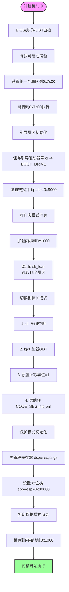
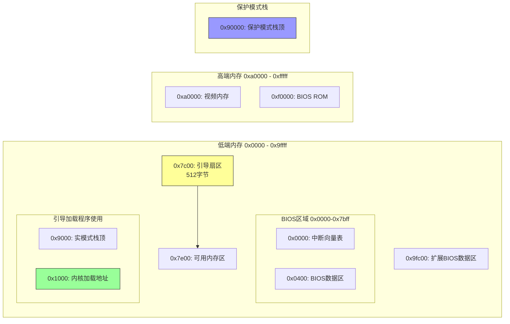
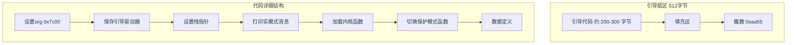

# bootsect.asm 启动流程详解

## 概述

本文档详细讲解操作系统引导加载程序（boot sector）的工作流程，以 `boot/bootsect.asm` 为例。我们将从 BIOS 加载引导扇区开始，逐步分析代码，直至跳转到内核。

## 1. 引导扇区基础知识

### 1.1 BIOS 的启动过程

当计算机加电后，BIOS 会执行以下操作：
1. 自检（POST）
2. 初始化硬件
3. 寻找可启动设备（如硬盘、软盘、USB）
4. 读取设备的第一个扇区（512 字节）到内存地址 `0x7c00`
5. 跳转到 `0x7c00` 执行

### 1.2 实模式（Real Mode）

- 8086 兼容模式，使用 16 位寄存器和 20 位地址线（1 MB 内存空间）
- 地址计算：`段地址 × 16 + 偏移地址`
- 直接访问 BIOS 中断和硬件

### 1.3 保护模式（Protected Mode）

- 32 位模式，支持虚拟内存、分页、特权级
- 需要通过全局描述符表（GDT）管理内存段
- 引导加载程序需要从实模式切换到保护模式

## 2. 代码逐段解析

### 2.1 初始设置

```assembly
[org 0x7c00]
KERNEL_OFFSET equ 0x1000

    mov [BOOT_DRIVE], dl
    mov bp, 0x9000
    mov sp, bp
```

- `[org 0x7c00]`：告诉汇编器，这段代码将被加载到 `0x7c00` 处，所有地址引用都基于此。
- `KERNEL_OFFSET equ 0x1000`：定义内核加载的内存地址（0x1000）。
- `mov [BOOT_DRIVE], dl`：BIOS 将启动驱动器号保存在 `dl` 中，将其存储到内存变量 `BOOT_DRIVE`。
- 设置栈指针：`bp` 和 `sp` 都指向 `0x9000`，栈从高处向下生长。

### 2.2 实模式打印消息

```assembly
    mov bx, MSG_REAL_MODE 
    call print
    call print_nl
```

- 调用打印函数，显示 "Started in 16-bit Real Mode"。
- `print` 和 `print_nl` 函数在 `boot/print.asm` 中定义，使用 BIOS 中断 `0x10`。

### 2.3 加载内核

```assembly
    call load_kernel
```

`load_kernel` 函数（位于 `boot/bootsect.asm` 中）：
```assembly
[bits 16]
load_kernel:
    mov bx, MSG_LOAD_KERNEL
    call print
    call print_nl

    mov bx, KERNEL_OFFSET
    mov dh, 16
    mov dl, [BOOT_DRIVE]
    call disk_load
    ret
```

- 显示加载消息。
- 设置参数：目标地址 `bx = 0x1000`，扇区数 `dh = 16`，驱动器号 `dl`。
- 调用 `disk_load`（在 `boot/disk.asm` 中）从磁盘读取内核。

### 2.4 切换到保护模式

```assembly
    call switch_to_pm
```

`switch_to_pm` 函数（位于 `boot/switch_pm.asm` 中）：
```assembly
[bits 16]
switch_to_pm:
    cli
    lgdt [gdt_descriptor]
    mov eax, cr0
    or eax, 0x1
    mov cr0, eax
    jmp CODE_SEG:init_pm
```

步骤：
1. `cli`：关闭中断。
2. `lgdt [gdt_descriptor]`：加载全局描述符表（GDT）。
3. 设置 `cr0` 寄存器的第 0 位（保护模式使能位）。
4. 远跳转：跳转到代码段 `CODE_SEG`（在 GDT 中定义）的 `init_pm` 处，同时刷新 CPU 流水线。

### 2.5 保护模式初始化

```assembly
[bits 32]
init_pm:
    mov ax, DATA_SEG
    mov ds, ax
    mov ss, ax
    mov es, ax
    mov fs, ax
    mov gs, ax

    mov ebp, 0x90000
    mov esp, ebp

    call BEGIN_PM
```

- 更新所有段寄存器为数据段选择子 `DATA_SEG`。
- 设置栈指针：`ebp` 和 `esp` 指向 `0x90000`（注意，现在是 32 位栈）。
- 调用 `BEGIN_PM`（在 `boot/bootsect.asm` 中）。

### 2.6 保护模式下的操作

```assembly
[bits 32]
BEGIN_PM:
    mov ebx, MSG_PROT_MODE
    call print_string_pm
    call KERNEL_OFFSET
    jmp $
```

- 打印保护模式消息（使用 `boot/32bit_print.asm` 中的函数）。
- 跳转到内核入口点 `0x1000`，将控制权交给内核。
- 如果内核返回（不应该），则无限循环。

## 3. 关键概念详解

### 3.1 磁盘读取

`disk_load` 函数使用 BIOS 中断 `0x13`（功能号 `0x02`）读取磁盘扇区。

参数：
- `dl`：驱动器号（0x80 表示第一个硬盘）
- `dh`：读取的扇区数
- `cl`：起始扇区（0x01 是引导扇区，0x02 是第一个可用扇区）
- `ch`：柱面号
- `dh`：磁头号
- `es:bx`：目标缓冲区地址

### 3.2 全局描述符表（GDT）

GDT 定义了内存段的属性，如基地址、限制和访问权限。

示例 GDT（在 `boot/gdt.asm` 中）：
- 空描述符（必须）
- 代码段描述符：基地址 0x0，限制 0xfffff，可执行、可读
- 数据段描述符：基地址 0x0，限制 0xfffff，可读写

### 3.3 内存布局

| 地址范围      | 用途                  |
|---------------|-----------------------|
| 0x0000 - 0x7bff | BIOS 数据区、中断向量表 |
| 0x7c00 - 0x7dff | 引导扇区（512 字节）    |
| 0x7e00 - 0x9fbff | 可用内存              |
| 0x9fc00 - 0x9ffff | 扩展 BIOS 数据区      |
| 0xa0000 - 0xfffff | 视频内存、ROM         |

引导加载程序使用的特定地址：
- `0x7c00`：引导扇区加载地址
- `0x9000`：实模式栈顶
- `0x1000`：内核加载地址
- `0x90000`：保护模式栈顶

## 4. 详细启动流程图



## 5. 详细内存布局图



## 6. 引导扇区结构图



## 6. 常见问题解答

### 6.1 为什么引导扇区是 512 字节？

这是历史遗留标准。硬盘扇区大小通常为 512 字节，BIOS 只读取第一个扇区。

### 6.2 如果内核超过 16 个扇区怎么办？

修改 `load_kernel` 中的 `dh` 值。但注意，引导扇区之后的可用空间有限，通常需要二级引导加载程序。

### 6.3 为什么需要 `times 510-($-$$) db 0` 和 `dw 0xaa55`？

- `times 510-($-$$) db 0`：将引导扇区填充到 510 字节。
- `dw 0xaa55`：最后两个字节必须是 `0x55` 和 `0xaa`（小端序），这是 BIOS 识别引导扇区的标志。

### 6.4 保护模式下的打印与实模式有何不同？

实模式使用 BIOS 中断 `0x10`，而保护模式下 BIOS 中断不可用。保护模式打印直接写入视频内存（`0xb8000`）。

## 7. 总结

引导加载程序是操作系统启动的第一步，它负责：
1. 初始化基本环境
2. 加载内核到内存
3. 从实模式切换到保护模式
4. 将控制权转交给内核

理解 `bootsect.asm` 是理解操作系统启动过程的关键。

---
*本教程基于 [cfenollosa/os-tutorial](https://github.com/cfenollosa/os-tutorial) 项目。*
